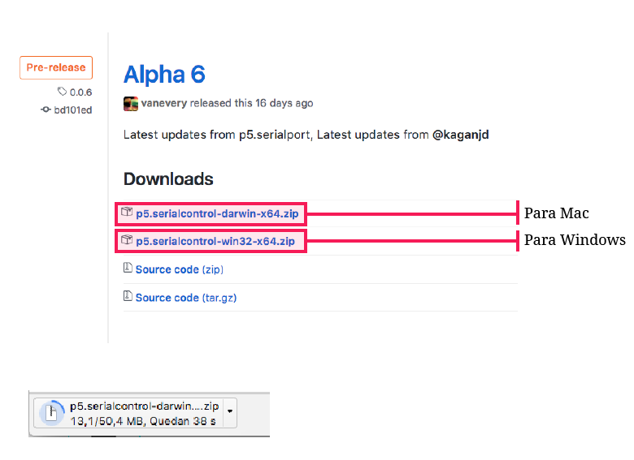
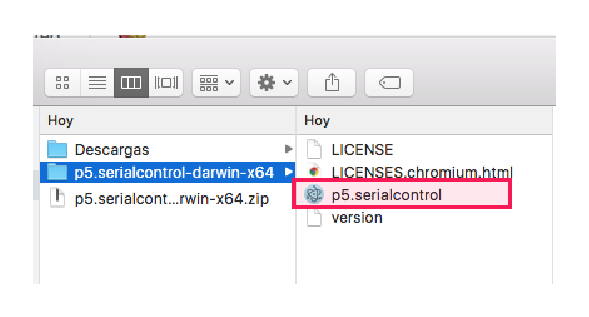
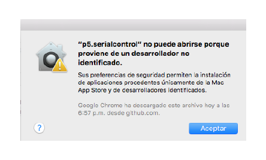
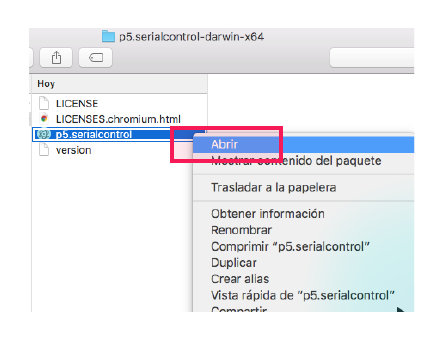
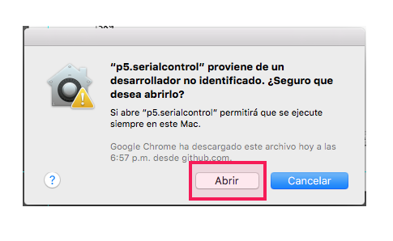
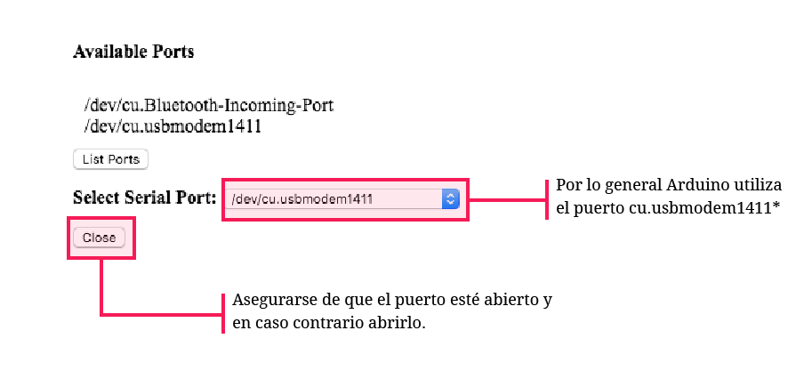
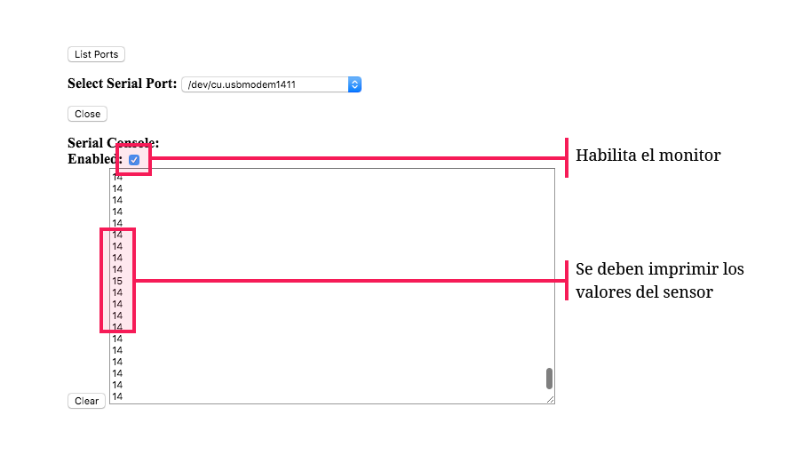
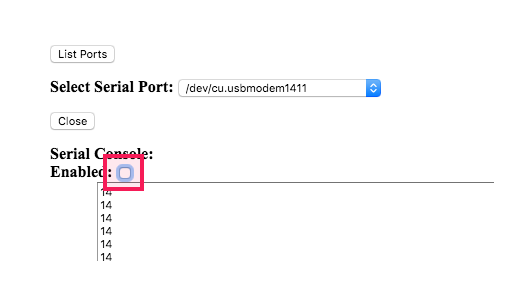

# 2. Recibir y enviar datos al navegador

Usualmente los navegadores no pueden acceder al puerto serial del computador. Por esto es necesario un programa que reciba los datos del puerto y los envíe al navegador. 

Se recomienda utilizar el navegador web **Google Chrome** para seguir estos pasos.

### a. Descargar la última versión de [p5.serialcontrol](https://github.com/vanevery/p5.serialcontrol/releases)

### b. Descomprimir la carpeta y hacer clic en la aplicación p5.serialcontrol

* Es posible recibir una alerta y no poder abrir la aplicación.

* En este caso hacer clic secundario sobre el archivo y elegir abrir.

* En la alerta que aparece hacer clic de nuevo en abrir.

### c. Abrir la aplicación y asegurarse de que el puerto seleccionado sea el correcto

* En Windows los nombres de los puertos suelen ser **COM3, COM4, COM5**. Una buena forma de saber cual es el puerto del Arduino es desconectarlo del equipo, mirar los puertos que aparecen y volver a conectarlo. De esta manera el puerto que cambia es el de la tarjeta Arduino.

### d. Habilitar el monitor serial de la aplicación para asegurarse que esta recibiendo los valores.

### e. Por último, deshabilitar el monitor y dejar la aplicación corriendo

Para este punto se deben tener dos programas corriendo: 

1. El **sketch de arduino** que se subió a la tarjeta, lee los datos del sensor y los envía por el puerto serial. No es necesario que la aplicación de arduino esté abierta. 
2. La aplicación **p5.serialcontrol** que puede leer datos del puerto serial y enviarlos a un navegador

### 

