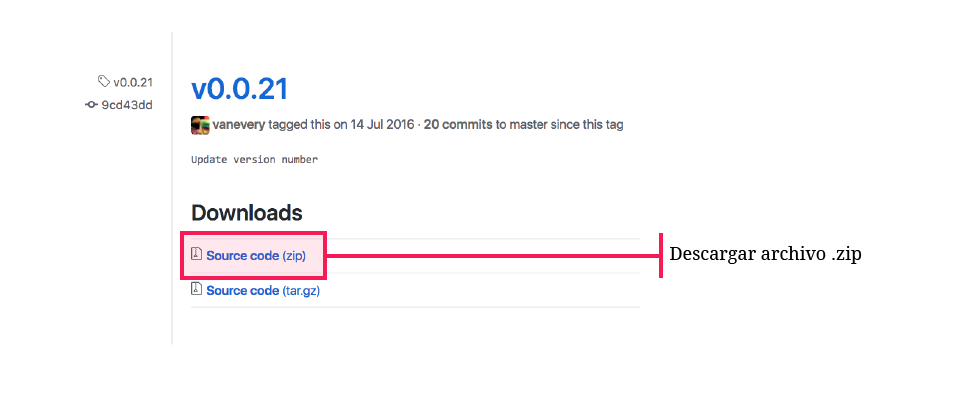
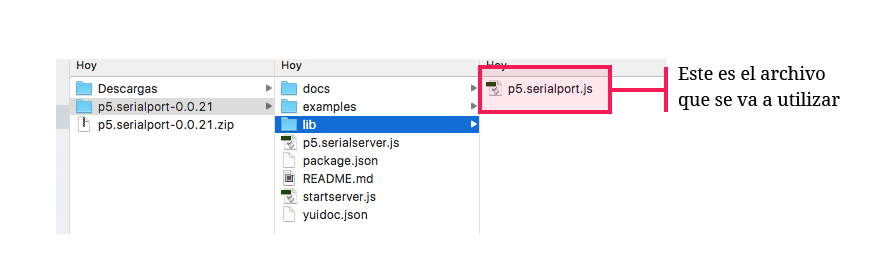
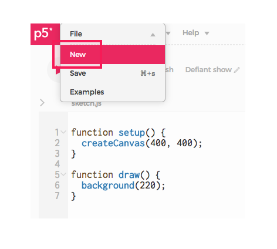
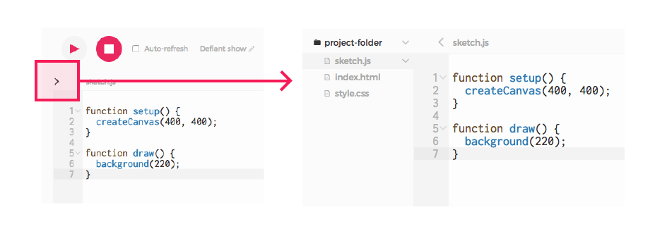
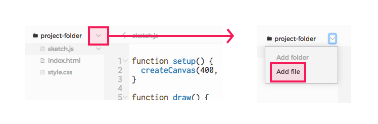
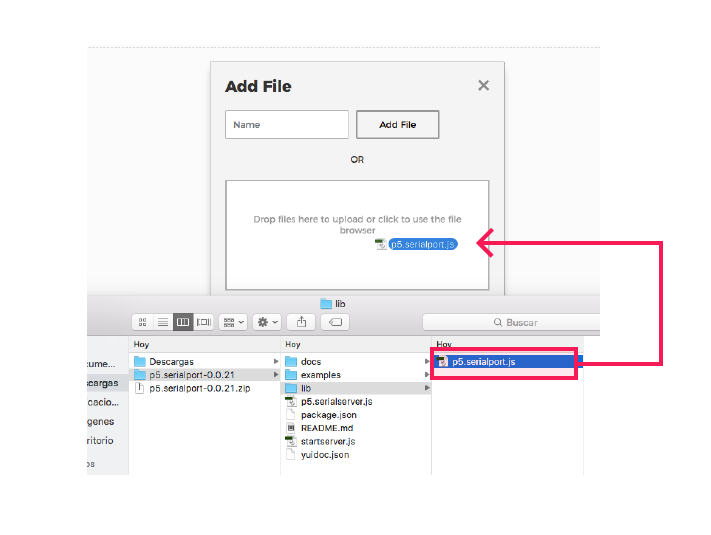
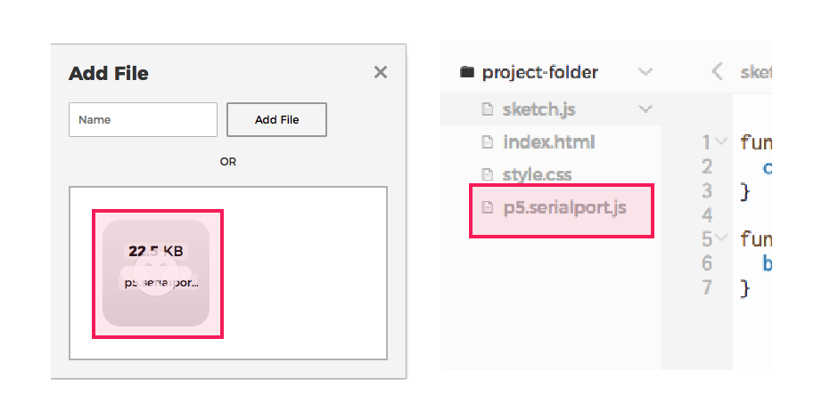
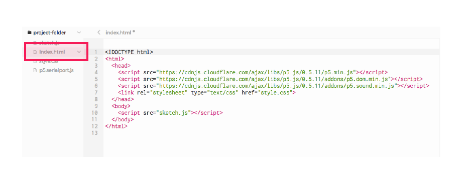

# 3. Instalar libreria en p5.js

Es necesario utilizar la librería p5.serialport para poder acceder a los datos del puerto serial desde p5.js

### a. Descargar la librería [p5.serialport](https://github.com/vanevery/p5.serialport/releases/tag/v0.0.21)



### b. Descomprimir la carpeta en el equipo



### c. Crear un nuevo sketch en el [editor web](http://alpha.editor.p5js.org/) de p5.js



### d. Agregar el archivo descargado: **p5.serialport.js** al sketch

* Desplegar el panel de archivos del sketch



* Hacer clic en **project-folder** y luego en **Add file**



* Aparece una ventana a la cual se debe arrastrar el archivo p5.serialport.js



Para poder agregar el archivo en el editor web es necesario estar logueado en la página

* El archivo debe aparecer en el panel de archivos del sketch



### e. Abrir el archivo index.html y hacer un enlace a la librería dentro del archivo



```markup
<!DOCTYPE html>
<html>

  <head>
  
    <script src="p5.min.js"></script>
    <script src="p5.dom.min.js"></script>
    <script src="p5.sound.min.js"></script>
    
    <!-- Agregar esta línea -->
    <script language="javascript" type="text/javascript" src="p5.serialport.js"></script>
    
    <link rel="stylesheet" type="text/css" href="style.css">
    
  </head>
  
  <body>
  
    <script src="sketch.js"></script>
    
  </body>
  
</html>
```

