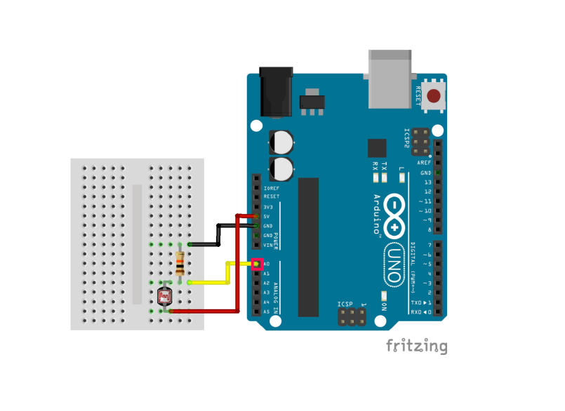
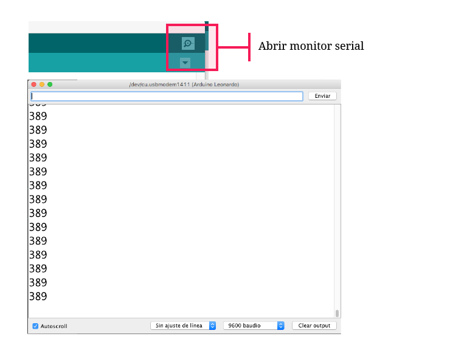
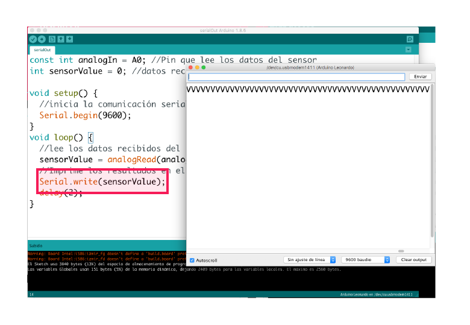
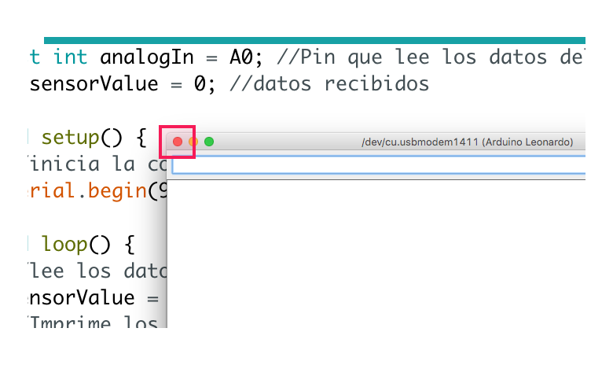

# 1. Enviar datos desde Arduino

EL código de este tutorial se puede ver y descargar [acá](https://github.com/disenoMediosInteractivos/Tutoriales/tree/master/02_arduino_serial/c%C3%B3digo)

**Materiales:**

* Arduino \([instalar software](https://www.arduino.cc/en/main/software)\) 
* Cable de conexión Arduino
* [Potenciómetro](https://commons.wikimedia.org/wiki/File:Potentiometer.jpg) o [fotoresistencia](https://commons.wikimedia.org/wiki/File:Fotocelda.jpg) 

### a. Preparar el circuito: conectar potenciómetro o fotoresistencia al arduino



El sensor debe estar conectado al pin A0 de entrada análoga

### b. En Arduino escribir un programa que lee los datos del sensor y los imprime en el monitor serie

```cpp
const int analogIn = A0; //Pin que lee los datos del sensor
int sensorValue = 0; //datos recibidos

void setup() {

  //inicia la comunicación serial en 9600 bps:
  Serial.begin(9600);
  
}

void loop() {

  //lee los datos recibidos del sensor y los guarda en la variable sensorValue
  sensorValue = analogRead(analogIn); 
  
  //Imprime los resultados en el monitor serial
  Serial.println(sensorValue);
  delay(2);
  
}
```

[Serial.println\(\)](https://www.arduino.cc/reference/en/language/functions/communication/serial/println/)**:**  Comando que envía los datos recibidos en formato [ASCII](https://ascii.cl/es/) al puerto serial y permite verlos en el monitor

* Al correr el programa y abrir el monitor serie se ven los valores enviados por el sensor:



Un **puerto serie** es una interfaz de comunicaciones de datos digitales, utilizado por computadoras donde la información es transmitida enviando **un solo bit a la vez**.

### c. Cambiar la línea **Serial.println\(\)** por **Serial.write\(\)** Correr el programa de nuevo.

```cpp
void loop() {

  //lee los datos recibidos del sensor y los guarda en la variable sensorValue
  sensorValue = analogRead(analogIn); 
  
  //Imprime los resultados en el monitor serial
  Serial.write(sensorValue);
  delay(2);
  
}
```

[Serial.write\(\)](https://www.arduino.cc/reference/en/language/functions/communication/serial/write/) envía los datos al puerto serie en forma de **bytes**. No están traducidos al formato ASCII \(el que leemos normalmente\)



### d. Una vez el programa se haya subido cerrar el monitor serie

Esto debido a que solo una aplicación a la vez puede estar leyendo los datos del puerto serie.



* Una vez el sketch se haya subido a la tarjeta, ésta empezará a emitir los datos del sensor. No es necesario mantener la aplicación de Arduino abierta.

