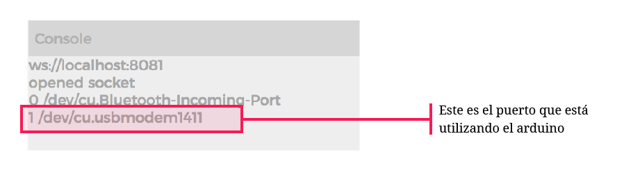

# 4. Leer y visualizar datos en p5.js

### a. Imprimir la lista de **puertos seriales** en p5.js

```javascript
var serial; // Variable que guarda una instancia de la libreria p5.serialport

function setup() {

  // crea una nueva instancia de la libreria p5.serialport
  serial = new p5.SerialPort(); 
  
  serial.on('list', printList); //llama a la función printList

}

//función que imprime una lista con los puertos seriales disponibles
function printList(portList) {

  // portList es una lista con los puertos
  for(var i = 0; i < portList.length; i++) {
  
    //imprime los puertos en la consola
    console.log(i + " " + portList[i]);
    
  }
}
```

Al correr este código se imprime en la consola del editor la lista de **puertos disponibles**.



### b. Agregar eventos seriales

```javascript
var serial; // Variable que guarda una instancia de la libreria p5.serialport
var portName = '/dev/cu.usbmodem1421'; //variable con el nombre del puerto

function setup() {

  // crea una nueva instancia de la libreria p5.serialport
  serial = new p5.SerialPort(); 
  
  serial.on('list', printList); //llama a la función printList
  
  serial.on('connected', serverConnected); // llama a la función printList
  serial.on('open', portOpen); // llama a la función portOpen
  serial.on('data', serialEvent); // llama a la función serialEvent
  serial.on('error', serialError); // llama a la función serialError
  serial.on('close', portClose); // llama a la función portClose

  serial.open(portName); // open a serial port

}

//función que imprime una lista con los puertos seriales disponibles
function printList(portList) {

  // portList es una lista con los puertos
  for(var i = 0; i < portList.length; i++) {
  
    //imprime los puertos en la consola
    console.log(i + " " + portList[i]);
    
  }
}
```

Se están creando una serie de llamados que correrán unas funciones especificas cuando suceda alguno de los siguientes eventos: 

* **list** – El programa pide una lista de puertos 
* **connected** – cuando se conecte a la aplicación p5.serialcontrol 
* **open** – un puerto serial es abierto 
* **close** – un puerto serial es cerrado 
* **data** – se reciben datos de un puerto serial 
* **error** – algo sale mal

### c. Crear las **funciones** que responden a cada **evento serial**

```javascript
function serverConnected() {
  println('conectado al servidor');
}

function portOpen() {
  println('el puerto serial fue abierto')
}

function serialEvent() { //llamada cuando se reciben datos al puerto serial

}

function serialError(err) {
  println('algo salió mal' + err);
}

function portClose() {
  println('el puerto serial se cerró');
}
```

La función **serialEvent\(\)** es la que recibe los datos del puerto serial

### **d.** Crear una variable global para guardar los datos recibidos

```javascript
var data = 0; //datos que llegan del puerto serial
```

### e. Modificar la función serialEvent\(\) para mostrar los datos en consola.

```javascript
function serialEvent() { //llamada cuando se reciben datos al puerto serial

  data = serial.read(); //lee los datos
  console.log(data); //los imprime
  
}
```

Ahora que se tienen los datos recibidos del sensor en una variable de p5.js se pueden utilizar para dibujar en la función **draw\(\)**.

### f. Pintar una elipse cuyo tamaño responda a los valores del sensor

```javascript
function draw() {

  background(0);
  fill(255);
  
  //dibuja una elipse con radio dictado por los datos recibidos
  ellipse(width / 2, height / 2, data, data);
  
}
```


