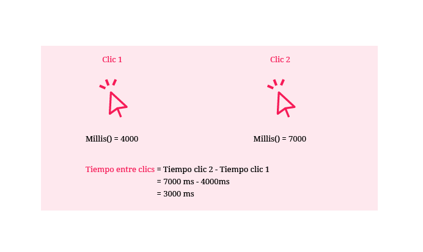
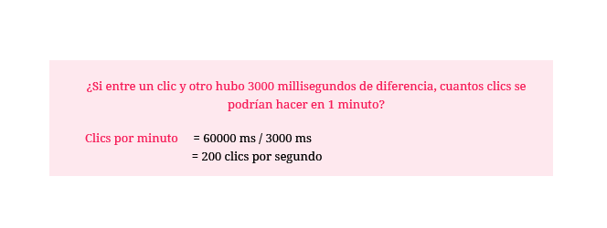

# 4. Clics por minuto

**¿Cómo conocer la frecuencia con la que se realiza una acción?** Se puede ver el código de este ejemplo [acá](http://alpha.editor.p5js.org/laurajunco/sketches/S1dBY5RRW)

### a. Conocer el tiempo entre un clic y otro.

El primer paso para conocer la frecuencia con la que se realiza algo es medir la **diferencia de tiempo** entre una acción y la siguiente



### b. Generalizar ese intervalo para una cantidad de tiempo mayor

Después de conocer el tiempo entre dos acciones, es posible saber cuantas acciones se pueden hacer en un intervalo de tiempo determinado.



* En un minuto hay 60000 millisegundos

### c. Crear variables para guardar la información de los clics

```javascript
//crea una lista para guardar el tiempo entre dos clics
var tiempo = [0, 0];

//variable para guardar la velocidad de los clics
var vel = 0;
```

  
La variable **tiempo** es una **lista** de 2 posiciones en la que se guardarán los tiempos en los que se haga clic.

### d. Guardar el tiempo cuando se haga clic

Cuando se hace clic por segunda vez se corren los valores de la lista.

```javascript
//funcion que se llama cuando se hace clic
function mouseClicked() {

    //el tiempo del segundo clic se desplaza a la segunda posicion
    tiempo[0] = tiempo[1];
    
}
```

Se guarda el tiempo del clic en la segunda posición de la lista que se creó.

```javascript
//funcion que se llama cuando se hace clic
function mouseClicked() {

    //el tiempo del segundo clic se desplaza a la segunda posicion
    tiempo[0] = tiempo[1];
    
    // se guarda el tiempo del primer clic en el arreglo
    
tiempo[1] = millis();
    
}
```

### e. Obtener la cantidad de clics por minuto

```javascript
//la velocidad de la bola se obtiene de la division de
//60 segundos entre el intervalo de dos clics

//tiempo[1] = tiempo en el que se hizo el primer clic
//tiempo[0] = tiempo en el que se hizo el segundo clic

var vel = 60000 / (tiempo[1] - tiempo[0]);
```

Para hacer más sencilla la medición, es posible definir el numero de clics por minuto como 0 si el intervalo entre un clic y otro es mayor a un valor determinado.

```javascript
//si han pasado mas de 200 millisegundos entre un clic y
//otro se asigna un valor de 0 a la velocidad

if (millis() - tiempo[1] > 200) {
    vel = 0;
}
```

### f. Imprimir el numero de clics por minuto en la pantalla

```javascript
//texto de la pantalla
//floor() redondea el numero de vel a un valor entero

text(floor(vel) + " clics por minuto", 30, 30);
```


