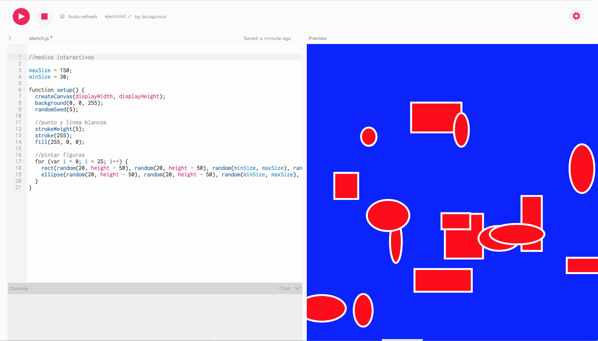
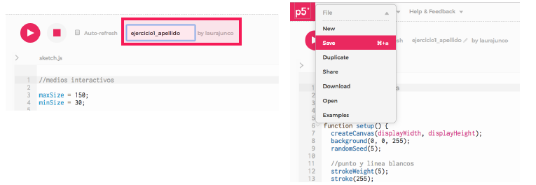
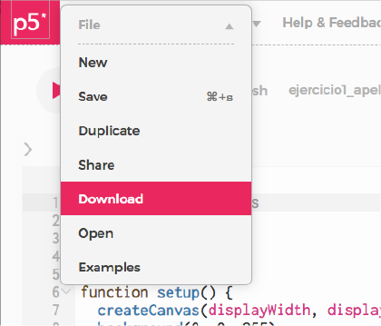
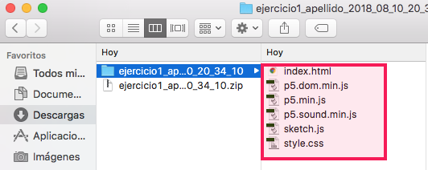
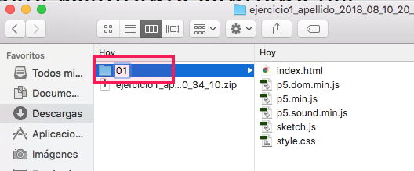

# 1. Obtener los archivos

* Estar seguro de que el sketch corre bien y sin errores en el [editor de p5.js](http://alpha.editor.p5js.org/)

* Poner un nombre al sketch y **guardarlo**

*  Hacer clic en el botón **Download**, lo cual descargará un archivo **.zip** al computador

* **Descomprimir** el .zip. La carpeta resultante contiene los archivos necesarios para publicar el sketch en la web.

* Es **recomendable** cambiar el nombre de la carpeta y asignarle el **número** del ejercicio actual

