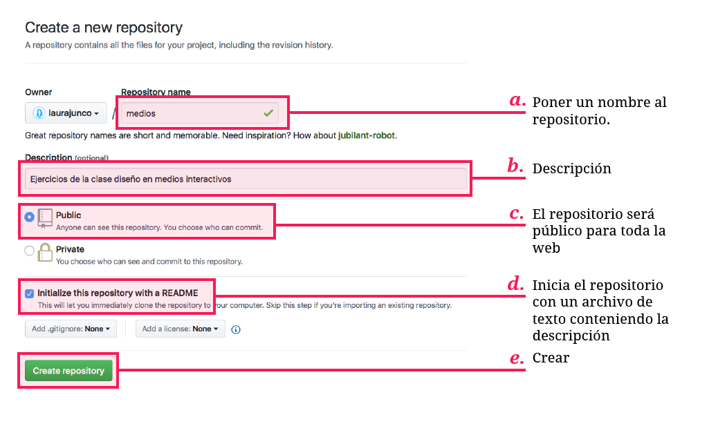
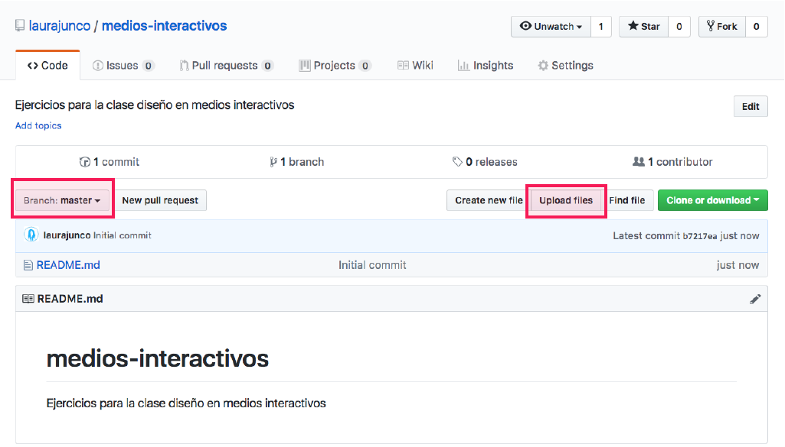

# 3. Crear un repositorio

Después de hacer clic en [Start a new Project](https://github.com/new). Se llenan los campos del repositorio donde estará el sketch

El repositorio debería verse de esta manera al crearlo:

## ¿Branch?

  
_En Github es posible que muchas personas estén trabajando en un proyecto al mismo tiempo. Así, cada una de ellas puede trabajar en un_ [_branch_](https://git-scm.com/book/en/v1/Git-Branching-What-a-Branch-Is) _o **rama** del proyecto realizando cambios que finalmente se podrán unificar con la **rama principal** \(master branch\)._

\_\_

Hacer clic en **Upload files**

**Arrastrar la carpeta** del ejercicio de p5.js al navegador

Una vez los archivos hayan terminado de subir hacer clic en **Commit**

Después de subir los archivos el repositorio debe verse de esta manera:

Y la carpeta del ejercicio así:

