# 2. Crear índice para los ejercicios

En esta parte del tutorial se va a incluir un índice para navegar el repositorio y poder acceder a cada ejercicio más fácilmente

## **a. Descargar plantilla del índice**

* Ir a [esta](https://github.com/disenoMediosInteractivos/Tutoriales/tree/master/indices) pagina y descargar el índice para [los alumnos](https://github.com/disenoMediosInteractivos/Tutoriales/blob/master/indices/indice_alumnos.html)

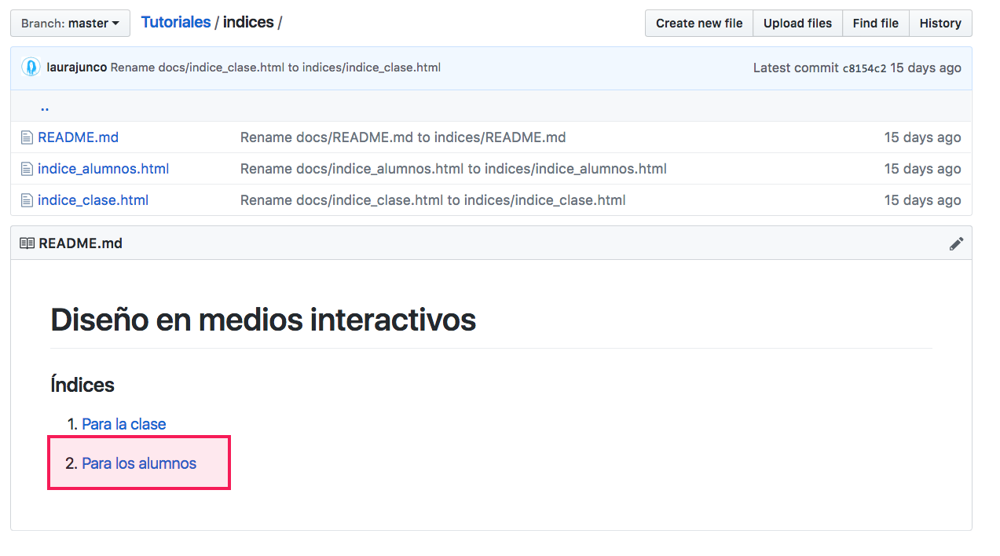

* Hacer clic en el botón **raw** para abrir el código en una pestaña nueva

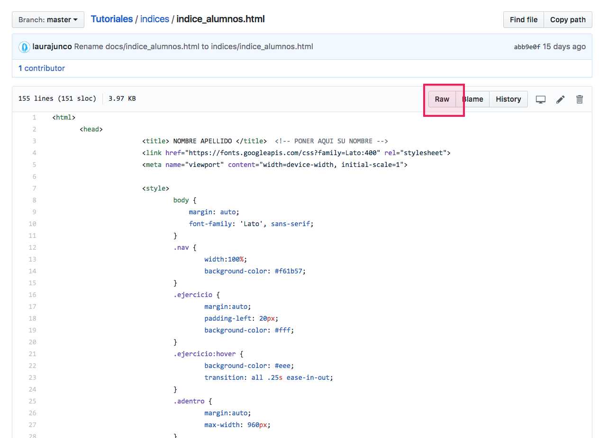

* En la nueva pestaña hacer clic derecho y en la opción **Guardar Cómo**

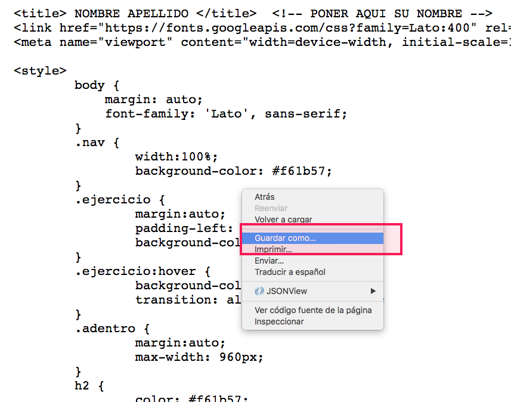

* Guardar el archivo con el nombre **index.html**

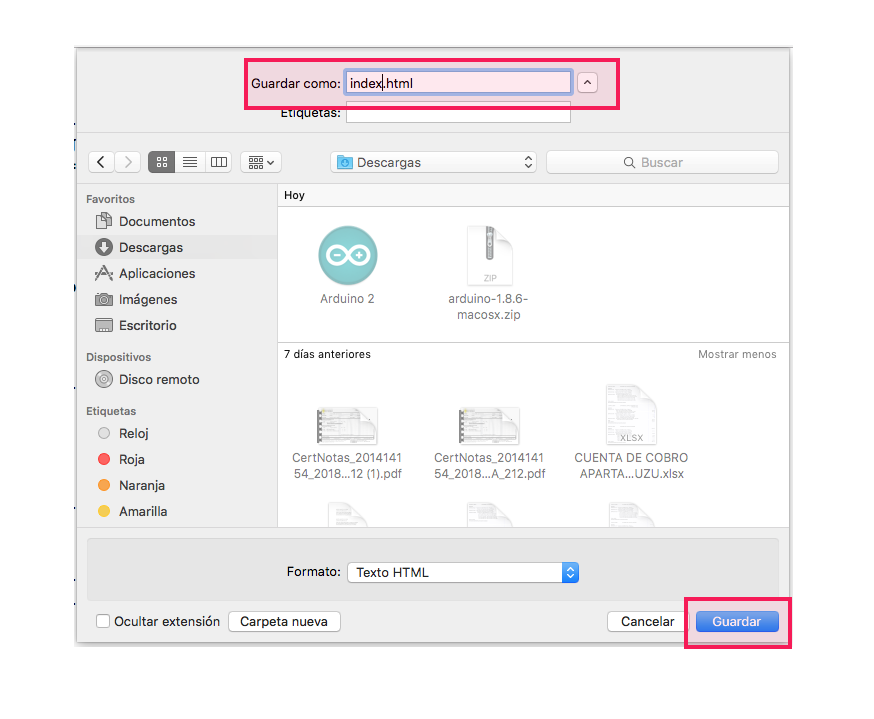

## b. Subir índice al repositorio

* Volver a la página del repositorio y hacer clic en **Upload files**

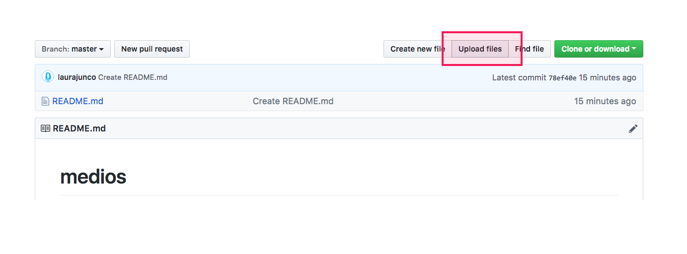

* Arrastrar el archivo **index.html** en la nueva pestaña

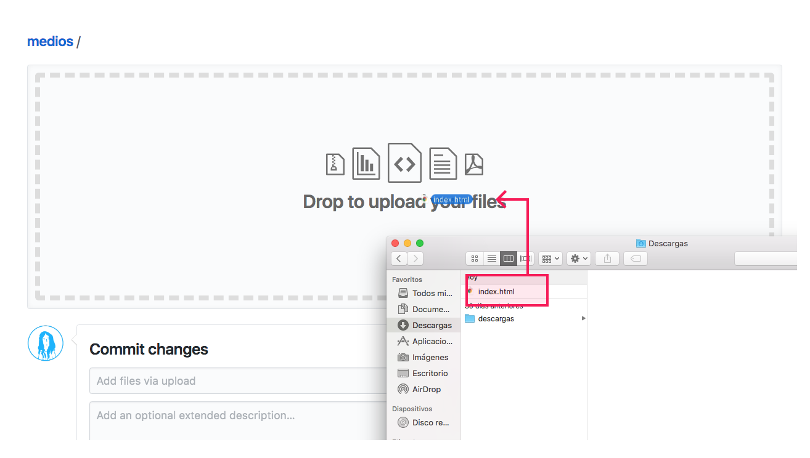

* Cuando el archivo haya terminado de cargar, hacer clic en **Commit changes**

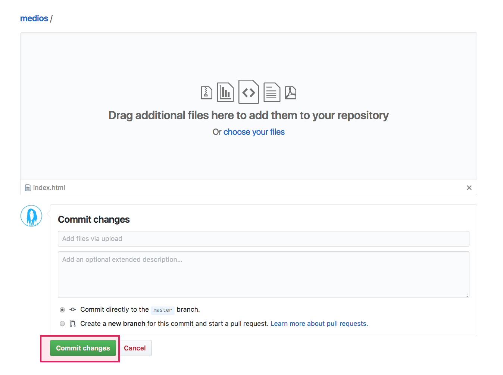

* Finalmente el repositorio debe verse de esta manera:

## c. Editar índice

Debido a que el índice es una plantilla que muchas personas pueden usar, es necesario personalizar algunas líneas

* Hacer clic en el archivo **index.html**

* Hacer clic en el botón de **edición**

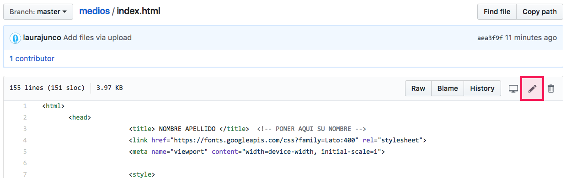

* Cambiar el **título** de la página html

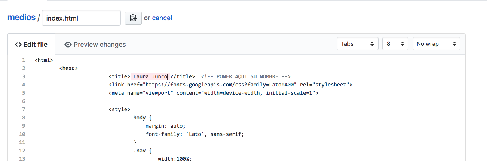

* Cambiar el **nombre** y link al **repositorio**

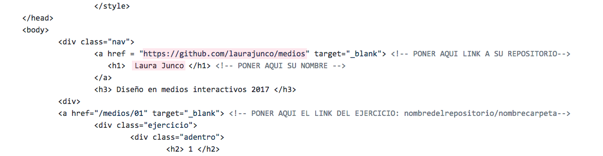

El link del repositorio se construye así : github.com/**nombre de usuario**/**nombre del repositorio**

* Revisar la url de cada uno de los ejercicios del índice

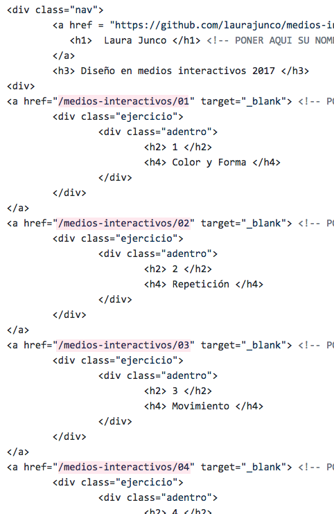

La ruta de cada ejercicio se construye así : /**nombre del repositorio/nombre de la carpeta del ejercicio**

* Hacer clic en **Commit changes** para guardar los cambios

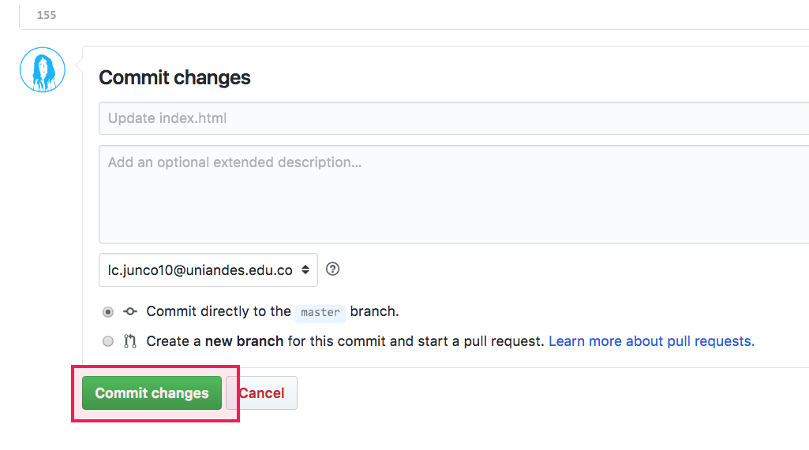

