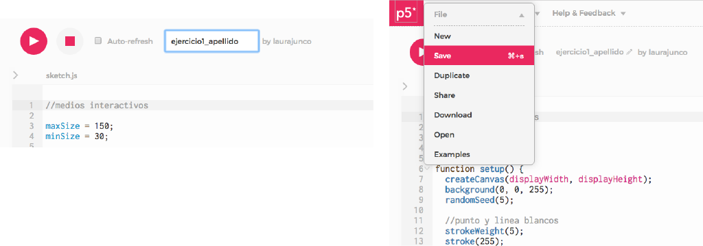

# Obtener los archivos

1. Estar seguro de que el sketch corre bien y sin errores en el [editor](http://alpha.editor.p5js.org)

2. Poner un nombre al sketch y guardarlo

3. Hacer clic en el botón **Download**, lo cual descargará un archivo **.zip** al computador

4. Descomprimir el .zip y la carpeta resultante contiene los archivos necesarios para publicar el sketch en la web.


**index.html** es el archivo leido por el navegador web 

**sketch.js** contiene el código que se escribió en el editor

Los demás archivos son bibliotecas de p5.js



Es recomendable cambiar el nombre de la carpeta y asignarle el número del ejercicio actual


## 

