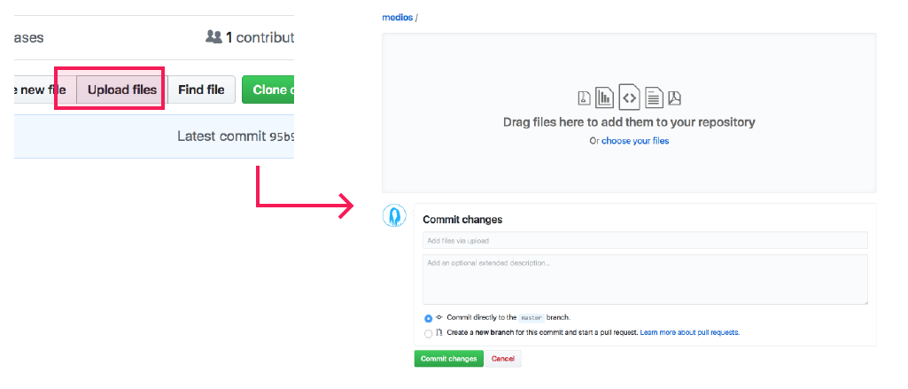
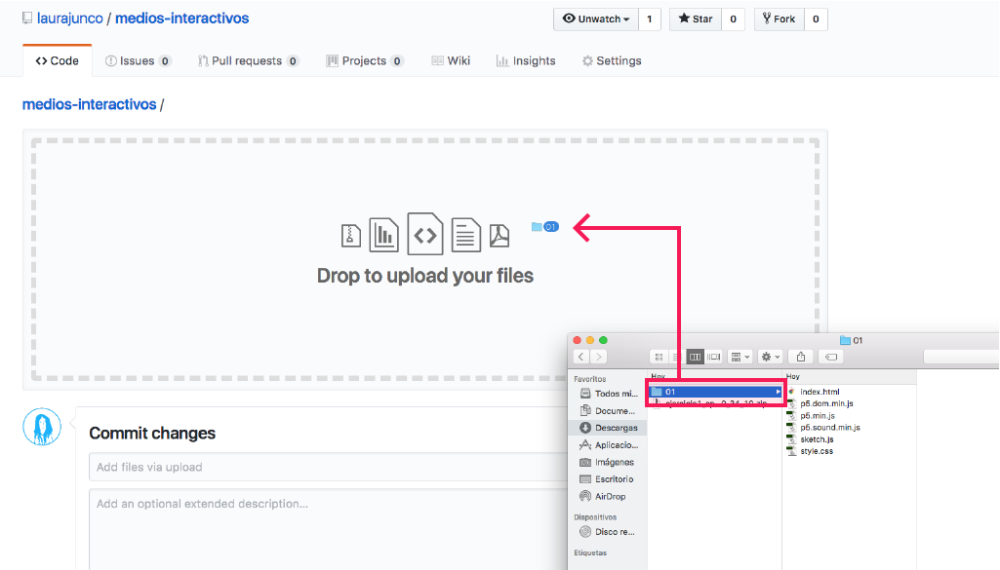
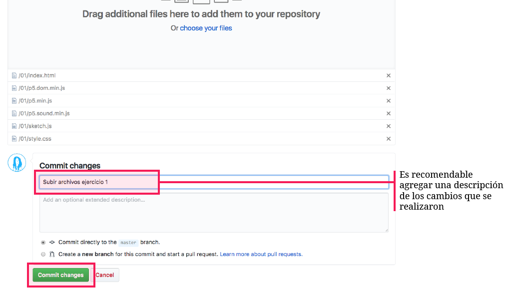
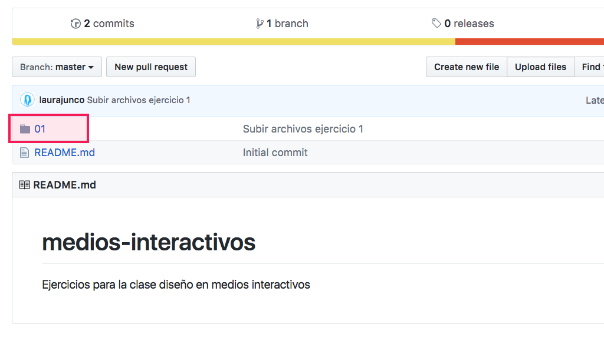
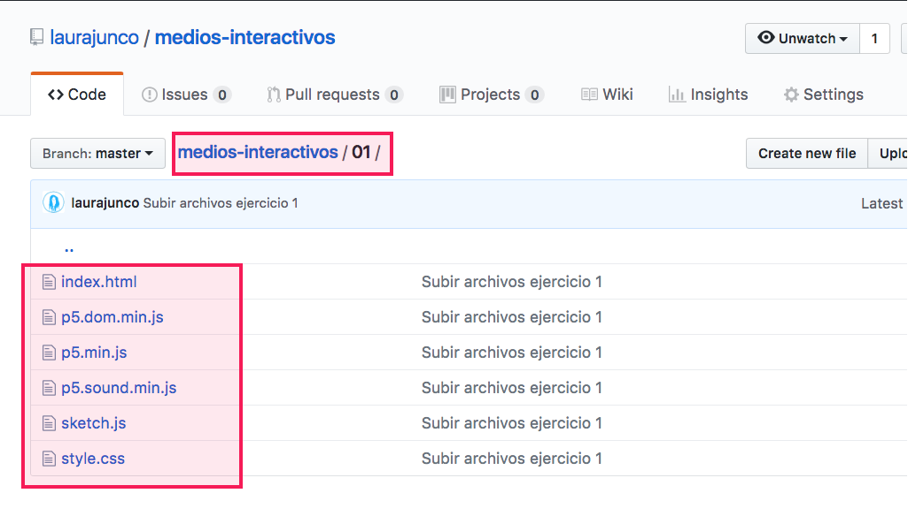
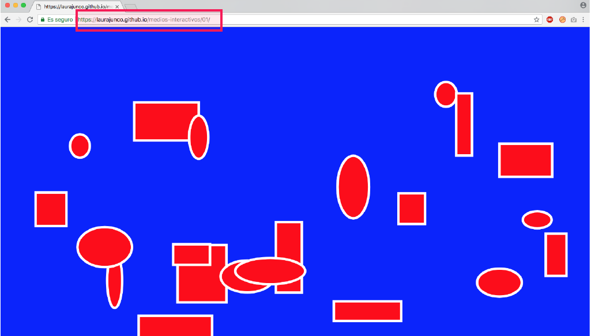

# 5. Subir ejercicio a Github

### a. Ir a la página del repositorio y hacer clic en **Upload files.**

* **Arrastrar la carpeta** del ejercicio de p5.js al navegador.

* Una vez los archivos hayan terminado de subir hacer clic en **Commit.**

* Después de subir los archivos el repositorio debe verse de esta manera:

* Y la carpeta del ejercicio así:

### b. Ir a la página de Github y revisar que el ejercicio esté en línea 

* Ir al índice que se subió anteriormente y hacer clic en el número del ejercicio que se subió

* El navegador web lee automáticamente el archivo **index.html** de la carpeta y el sketch ha quedado en línea

