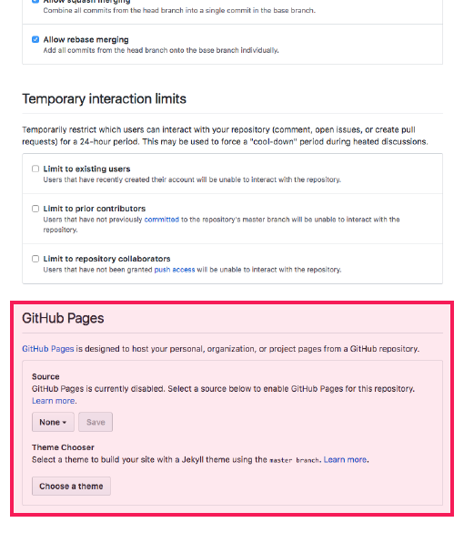
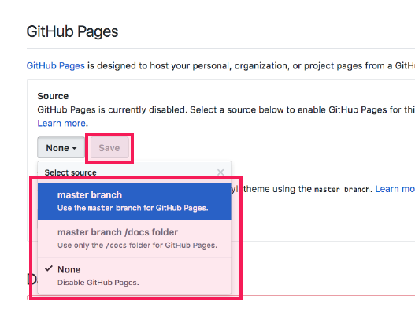
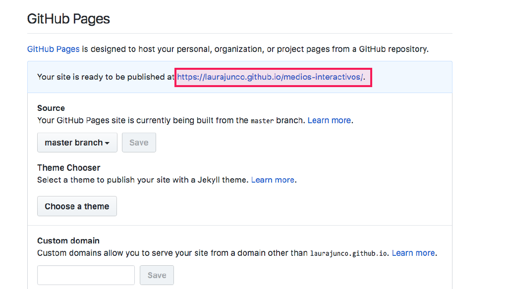

# 3. Publicar en Github Pages

## ¿Qué es Github Pages?

\_\_[_Github pages_](https://pages.github.com/) _es un servicio de Github que permite **publicar páginas web de manera gratuita** con el contenido de los repositorios._

\_\_

* En la página del repositorio ir a **Settings**

* Bajar hasta la sección llamada **Github Pages**

* En el campo **Source** cambiar la opción **None** por **Master Branch** y hacer clic en **Save**. Así, la página web mostrará el contenido de la rama principal del repositorio. 

* Ahora en el campo de Github Pages aparece el **link** de la página.  La carpeta ha quedado en línea en esa dirección web.

* El link lleva a una página web en la que se muestra el archivo **index.html**

