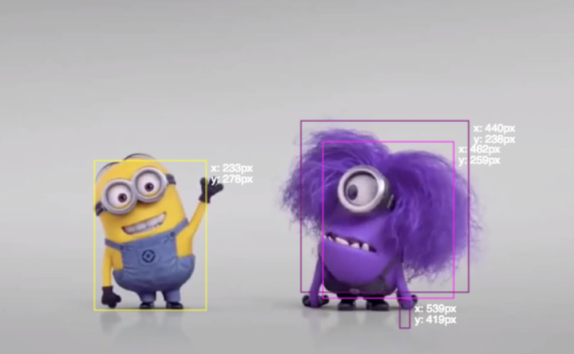

# 3. Detectar color

¿Cómo detectar objetos de un color especifico en la pantalla? El código de este ejemplo se puede ver [acá](https://editor.p5js.org/laurajunco/sketches/SJ3L5F_hX).



### a. Incluir librería para detectar colores

Para este Ejemplo se utilizará la librería [tracking.js](https://trackingjs.com/) la cual permite detectar colores y rostros en imágenes o videos.


* Descargar la librería  de [este enlace](https://github.com/eduardolundgren/tracking.js/archive/master.zip)
* Agregar el archivo llamado **tracking.js** al sketch de p5.js
* Agregar un link a la librería en el archivo **index.html**

```markup
<script src="tracking.js"> </script>
```

### b. Mostrar la imagen de captura en la misma posición del canvas

Para la librería es necesario que el elemento capture exista. Por lo tanto, en este ejemplo no es posible utilizar **capture.hide\(\).** Sin embargo, es posible alinear la captura de la cámara y el canvas en una misma posición:

* Crear un elemento contenedor para el video y el canvas en **index.html**

```markup
<div id="container"></div>
```

El archivo **index.html** debería verse de esta manera:

```markup
<!DOCTYPE html>
<html>
  <head>
    <script src="https://cdnjs.cloudflare.com/ajax/libs/p5.js/0.7.2/p5.min.js"></script>
    <script src="https://cdnjs.cloudflare.com/ajax/libs/p5.js/0.7.2/addons/p5.dom.min.js"></script>
    <script src="https://cdnjs.cloudflare.com/ajax/libs/p5.js/0.7.2/addons/p5.sound.min.js"></script>
	<script src="tracking.js"></script>
    <link rel="stylesheet" type="text/css" href="style.css">
    <meta charset="utf-8" />
  </head>
  
  <body>
    <div id="container"></div>
    <script src="sketch.js"></script> 
  </body>
</html>
```

* Agregar la captura y el canvas al mismo elemento en **setup\(\)**.

```javascript
 //incluye la captura y el canvas dentro del elemento 'container'
  capture.parent('container'); 
  canvas.parent('container'); 
```

* Por último, editar el archivo **style.css** y agregar las siguientes lineas:

```css
#container {
  position: relative;
}

canvas, video {
  width: 100%;
  height: 100%;
  position: absolute;
  top: 0;
  left: 0;
}
```

Este código modifica los estilos de los elementos de la página para que el video y el canvas queden en **la misma posición** en la pantalla.

### c. Inicializar el tracking 

* Crear una variable para guardar el tracker de la librería

```javascript
var tracker; // variable para guardar el tracker
```

* Crear una función donde se realizará la detección de color y ejecutarla en setup\(\)

```javascript
//esta función activa el tracking y encuentra el color seleccionado
function activarTracking() {
    
}
```

```javascript
function setup() {
    activarTracking();
}
```

* **Crear un tracker para el color amarillo**

Es necesario crear una variable para guardar un objeto de tracking

```javascript
// variable para guardar el tracker de color
var tracker;
```

* Inicializar el objeto como un tracker de color

```javascript
//crea un tracker de color
tracker = new tracking.ColorTracker(['yellow']);
```

Tracking.js puede detectar por defecto los colores **cyan, magenta y amarillo**. Para este ejemplo se detectará el color amarillo.

* Es necesario especificar el elemento **html** que se analizará, en este caso: la captura de la cámara.

```javascript
//utilizar el tracker de color en la captura de la camara
tracking.track('video', tracker);
```

### d. Detectar color

Cada vez que el tracker reconoce un grupo de pixeles del color seleccionado **lanza un evento** al cual se puede acceder con la función **tracker.on\( 'track' \).**

```javascript
tracker.on('track', function (event) {

});
```

* Acceder a la información del evento y recorrer la lista de grupos de pixeles amarillos encontrados

```javascript
tracker.on('track', function (event) {

    //recorre la lista de grupos encontrados
    event.data.forEach(function (r) { 
    
    })
});
```

**event.data**  es la función que permite acceder a la información que obtiene el tracker. Este evento retorna una lista de grupos de pixeles del color seleccionado. Cada grupo de pixeles\(r\) tiene las siguientes características:

1. **r.x** = posición en **x** del grupo de pixeles
2. **r.y** = posición en **y** del grupo de pixeles
3. **r.height** = **altura** maxima del grupo de pixeles
4. **r.width** = **anchura** máxima del grupo de pixeles

* Imprimir los datos de cada evento

```javascript
tracker.on('track', function (event) {

    //recorre la lista de grupos encontrados
    event.data.forEach(function (r) { 
        console.log(r);
    }
}
```

### e. Dibujar con el color seleccionado

* Crear variables para la posición de la elipse que se dibujará:

```javascript
//variables de posición para pintar una elipse
var x; 
var y;
```

* Utilizar los valores obtenidos del tracking para actualizar la posición de la elipse

```javascript
tracker.on('track', function (event) {

    //recorre la lista de grupos encontrados
    event.data.forEach(function (r) { 
    
       //calcula el centro del cuadro y actualiza los valores de X y Y
        x = r.x + (r.width/2);
        y = r.y + (r.height/2);
    }
}
```

* pintar una elipse con las coordenadas obtenidas

```javascript
function draw() {

  //se pinta una elipse con las dimensiones y el lugar recibido
  fill(255, 255, 0);
  noStroke();
  
  //se utiliza width - x para dibujar en espejo
  ellipse(width - x, y, 15, 15);

}
```

* Por último ocultar el video y dejar un canvas en blanco

Para ocultar el video en este ejemplo \(ya que no se puede ocultar la captura sin que **tracking.js** deje de funcionar\) se utilizará un estilo en el archivo **style.css**

```css
video {
  visibility: hidden;
}
```

**Visibility: hidden** hace un elemento de html invisible sin necesidad de eliminarlo

* Borrar el canvas al hacer click

```javascript
function mousePressed() {

    //borra el canvas
    clear();
    
}
```

**Clear\(\)** elimina todo el contenido del canvas

