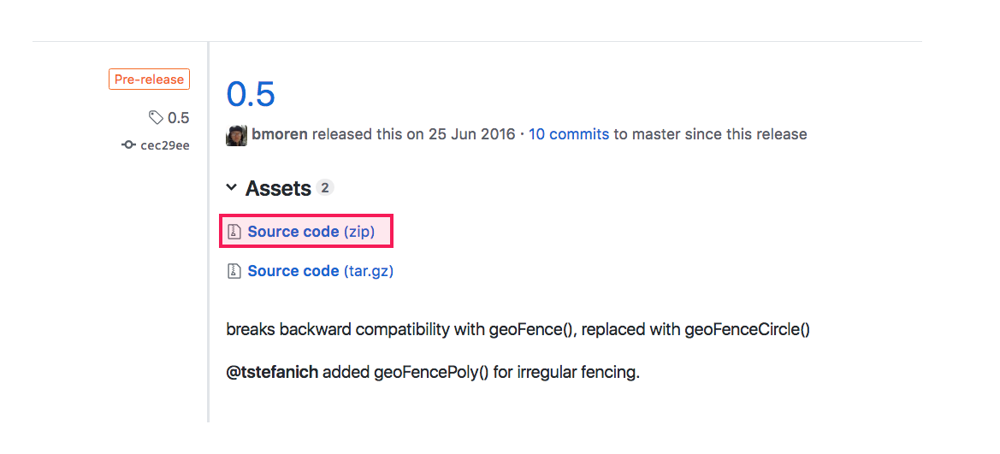
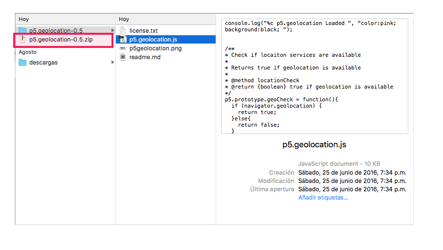
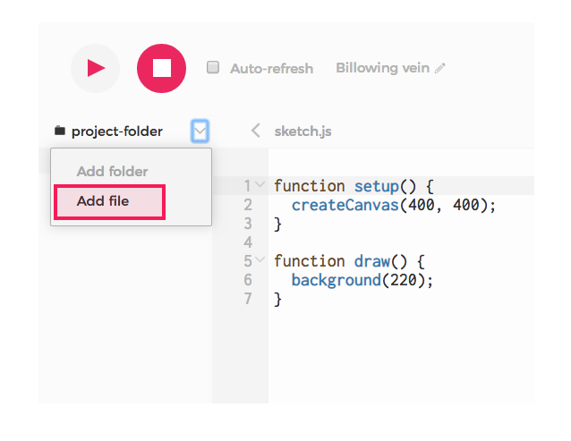
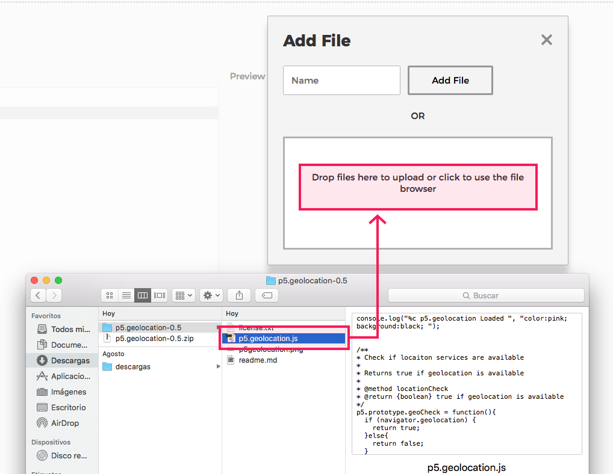
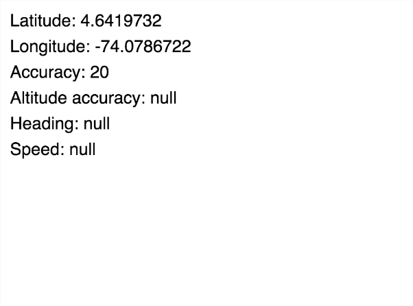

# 1. Configuración

Un sketch sencillo para obtener los datos de localización del dispositivo y dibujarlos en la pantalla.

### a. Descargar la libreria p5.geolocation.js

* Descargar la librería p5.js de [esta página](https://github.com/bmoren/p5.geolocation/releases)



* Descomprimir la carpeta



### b. Agregar librería al sketch de p5.js

* Ir a la carpeta de archivos del sketch y hacer clic en **Add File**



* Arrastrar a la pantalla el archivo **p5.geolocation.js**



* Agregar link a la libreria en **index.html**

```markup
<script src="p5.geolocation.js"></script>
```

* El archivo **index.html** debería verse así:

```markup
<!DOCTYPE html>
<html>
  <head>
    <script src="https://cdnjs.cloudflare.com/ajax/libs/p5.js/0.6.1/p5.min.js"></script>
    <script src="https://cdnjs.cloudflare.com/ajax/libs/p5.js/0.6.1/addons/p5.dom.min.js"></script>
    <script src="https://cdnjs.cloudflare.com/ajax/libs/p5.js/0.6.1/addons/p5.sound.min.js"></script>
    <script src="p5.geolocation.js"></script>
    <link rel="stylesheet" type="text/css" href="style.css">
    <meta charset="utf-8" />
  </head>
  <body>
    <script src="sketch.js"></script>
  </body>
</html>
```

### c. Obtener datos de localización del dispositivo

* Crear variables para guardar los datos de localización

```javascript
var lat; //latitud
var lng; //longitud
var accuracy; //precisión
var altitude; //altitud
var altitudeAccuracy; //presición en altitud
var heading; //dirección
var speed; //rapidez
```

Las variables que más se van a utilizar son latitud y longitud. Para poder acceder a las variables de **altitud**, **dirección \(heading\)** y **rapidez \(heading\)** el dispositivo debe estar en movimiento a una **velocidad considerable**.

* Acceder a la localización del dispositivo

```javascript
//Si geoCheck es true es que es posible medir la posicion del dispositivo
console.log("GeoCheck: " + geoCheck());
  
//Se llama a la función doThisOnLocation cada vez que cambie la posicion del usuario
watchPosition(doThisOnLocation);
```

La función **watchPosition\(\)** es llamada cada vez que haya un cambio de posición significativo en la posición del usuario. watchPosition ejecuta a la función **doThisOnLocation**

```javascript
//Esta función es llamada por watchPosition cada vez que cambia la posicion del usuario
//La variable position es un objeto con los datos de localizacion del dispositivo
function doThisOnLocation(position) {

  //toma la posicion del dispositivo y asigna valores a las variables de posicion
  lat = position.latitude;
  lng = position.longitude;
  accuracy = position.accuracy;
  altitudeAccuracy = position.altitudeAccuracy;
  heading = position.heading;
  speed = position.speed;
}
```

Esta función **lee** los datos de localización del dispositivo y ****los **asigna** a las variables creadas previamente

### d. Dibujar los datos en la pantalla

```javascript
function draw() {
  background(255);

  //dibuja en la pantalla los valores de posición obtenidos
  text("Latitude: " + lat, 10, 30);
  text("Longitude: " + lng, 10, 60);
  text("Accuracy: " + accuracy, 10, 90);
  text("Altitude accuracy: " + altitudeAccuracy, 10, 120);
  text("Heading: " + heading, 10, 150);
  text("Speed: " + speed, 10, 180);
}
```




