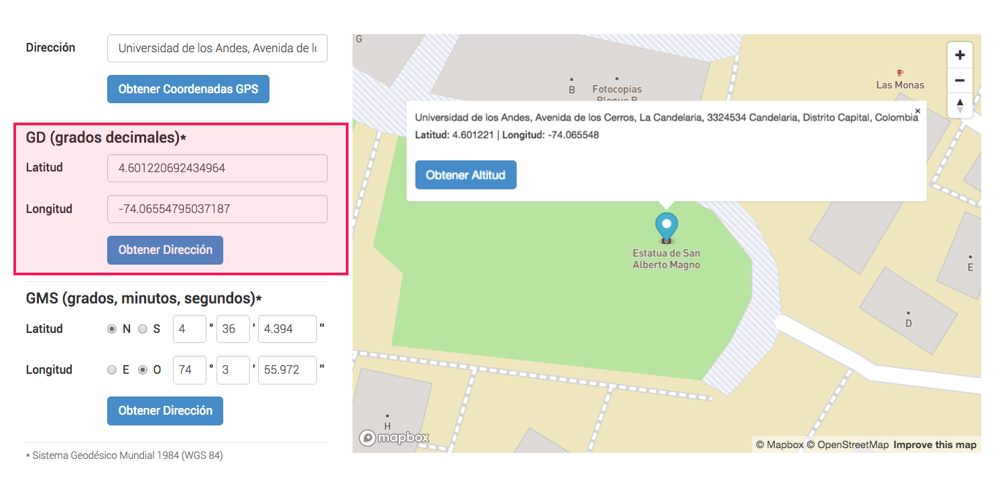
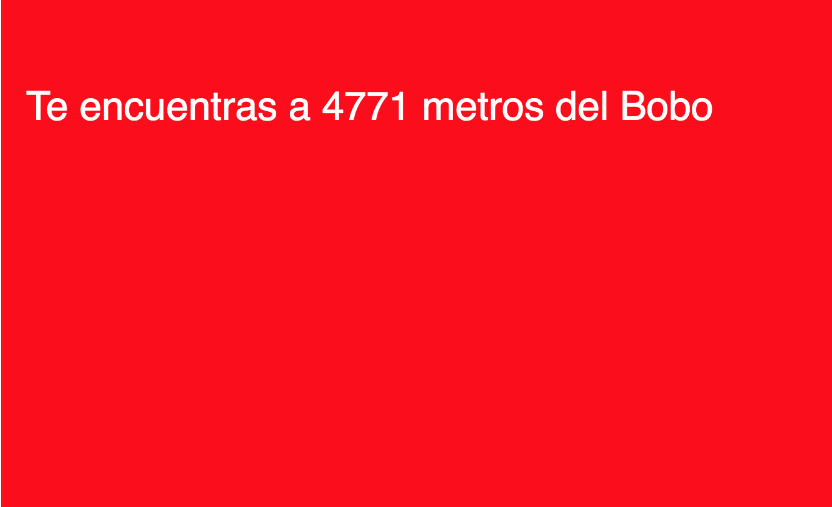
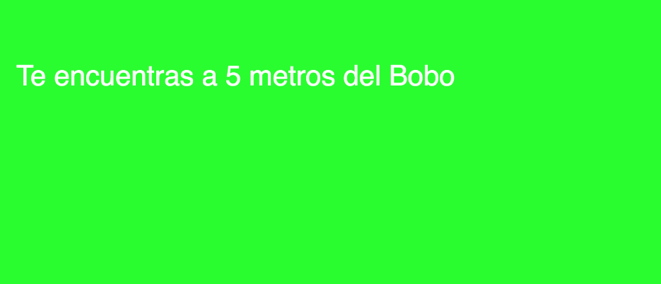

# 2. Conocer distancias

En este ejemplo se va medir la distancia entre el dispositivo y un lugar determinado.

### a. Obtener coordenadas del lugares con los cuales se quieren medir al distancia

* En [esta página ](https://www.coordenadas-gps.com/)se pueden obtener las coordenadas de un lugar en el mapa.



Para este caso tomaremos las coordenadas de la Estatua de **San Alberto Magno** en La **Universidad de los Andes**

* Guardar estas coordenadas en **variables** de p5.js

```javascript
var boboLat = 4.601215765889439; //latitud del bobo
var boboLon = -74.06554536195473; //longitud del bobo
```

### b.  Obtener datos de localización del dispositivo

* Crear variables para guardar la **posición del usuario**

```javascript
var currentLat; //latitud actual
var currentLon; //longitud actual
```

* Obtener datos del localización

```javascript
//Si geoCheck es true es que es posible medir la posicion del dispositivo
console.log("GeoCheck: " + geoCheck());

//Se llama a la función doThisOnLocation cada vez que cambie la posicion del usuario
watchPosition(doThisOnLocation);
```

* **Actualizar** las variables de latitud y longitud del usuario con los datos obtenidos

```javascript
function doThisOnLocation(position) {
  
  //se asigna la altitud y longitud obtenida a las variables currentLat y currentLon
  currentLat = position.latitude;
  currentLon = position.longitude;
}
```

### c. Medir distancia entre el dispositivo y el lugar

```javascript
function draw() {
  //calcula la distancia entre el usuario y el Bobo
  //se multiplica por 1000 para pasar de 'km' a 'm'
  var distanceBobo = calcGeoDistance(boboLat, boboLon, currentLat, currentLon, 'km')*1000;
}
```

La función **calcGeoDistance\(\)** calcula al distancia entre 2 coordenadas

### d. Pintar distancia en la pantalla

```javascript
  //Pinta las distancias en la pantalla
  text('Te encuentras a ' + floor(distanceRichard) + ' metros de la plazoleta del R', 20, 50);
```



### e. Si el dispositivo se encuentra en el lugar hacer algo

```javascript
 //Si la distancia menor a 20 metros cambia el color de fondo
  if (distanceBobo < 20) {
    
    background(0, 255, 0); //verde
  } else {
    
    background(255, 0, 0); //rojo
  }
```



