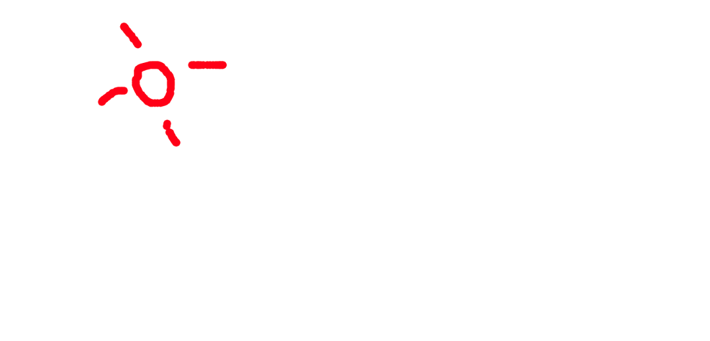
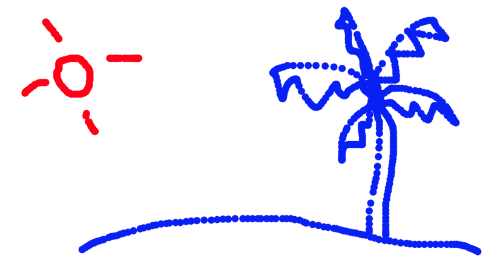

# 3. Enviar y recibir datos

En este tutorial se creará una plataforma de dibujo colaborativo en tiempo real. Se trabajará con el ejemplo [01\_connect](https://github.com/disenoMediosInteractivos/Ejemplos/tree/master/08_websocket/01_connect)

### a. Enviar datos al servidor

Para este ejemplo se enviarán datos al servidor cada vez que un usuario dibuje en la pantalla

* Pintar una elipse cuando se arrastre el mouse

```javascript
//esta función se ejecuta cada vez que el mouse se arrastra por la pantalla
function mouseDragged() {

  //dibuja una elipse en la posición del mouse
  fill(255, 0, 0);
  ellipse(mouseX, mouseY, 15, 15);
}
```



* Guardar los datos de posición del mouse en una variable

```javascript
  //en la variable 'data' se guarda la posición del mouse
  var data = {
    x: mouseX,
    y: mouseY
  }
```

* Enviar los datos guardados al servidor

```javascript
//envia la información del mouse al servidor
//el nombre del mensaje es 'mouse' y su contenido es 'data'
socket.emit('mouse', data);
```

La función **socket.emit\('nombre del mensaje', contenido\)** envía un mensaje al servidor. El nombre del mensaje es 'mouse' y su contenido son las coordenadas del mouse.

### b. Recibir los datos en el servidor

Cada vez que el servidor recibe un mensaje se lanza un evento. 

* Recibir mensaje y ejecutar una función

```javascript
//cuando recibe el mensaje 'mouse' ejecuta la función 'mouseMessage'
socket.on('mouse', mouseMessage);
```

Este código ejecuta a la función **mouseMessage** cada vez que el servidor recibe un mensaje con el nombre **'mouse'**

* Crear función para enviar datos a los demás usuarios.

En este caso la función del servidor es la de recibir los datos del mouse y reenviarlos a los demás usuarios que estén conectados

```javascript
//recibe los datos del mouse del cliente
function mouseMessage(data) { 
}
```

* Reenviar los datos recibidos a los demás usuarios conectados.

```javascript
//recibe los datos del mouse del cliente
function mouseMessage(data) {

    //reenvia el mensaje con los datos a todos los clientes (excepto a quien envió el mensaje)
    socket.broadcast.emit('mouse', data);
  }
```

* **socket.broadcast.emit\(\)** envía los datos a todos los usuarios conectados excepto al que envió el mensaje originalmente
* **io.emit\(\)** envía un mensaje a todos los usuarios conectados

### **c. Recibir los datos del servidor en p5.js**

Es necesario que el sketch reciba los datos enviados por el servidor.

* Recibir mensaje en el setup\(\)

```javascript
//cuando se reciba el mensaje 'mouse', se ejecuta la funcion 'newDrawing'
socket.on('mouse', newDrawing);
```

De esta manera, cada vez que se reciba un mensaje con el nombre **'mouse'** se ejecutará la función **newDrawing\(\)**

* Pintar los datos recibidos en la pantalla

```javascript
//se ejecuta cuando recibe el mensaje 'mouse' del servidor
//'data' son los datos que envia el servidor al socket
function newDrawing( data ) {

  fill(0, 0, 255);

  //dibuja una elipse en las coordenadas recibidas
  ellipse(data.x, data.y, 15, 15)
}
```

Así, cada vez que otro usuario dibuje en la pantalla de su sketch, esto será visible para todos.




