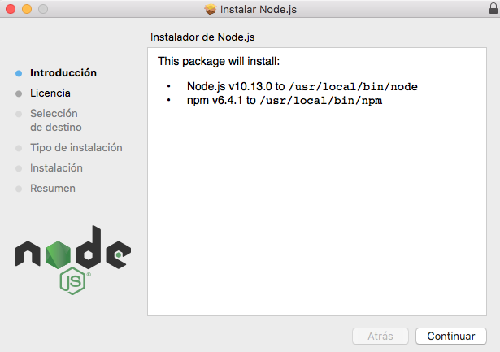
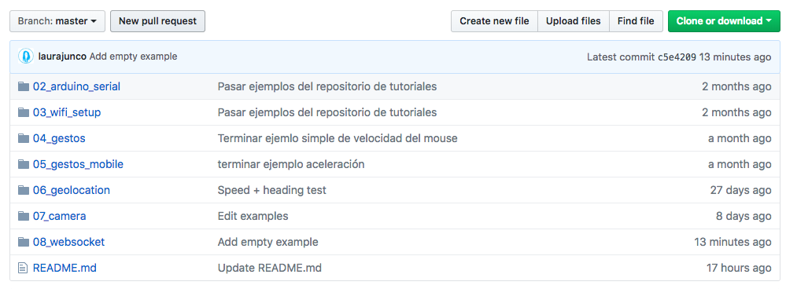
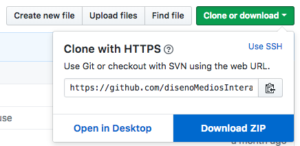
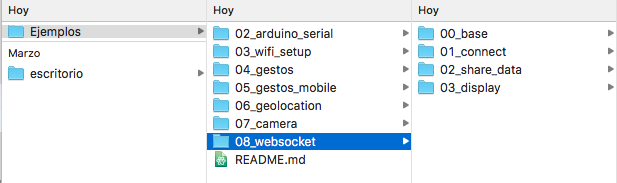

# 1. Configuración

### a. Descargar node.js

Node.js es un entorno de programación que permite desarrollar servidores web en Javascript. Es muy sencillo de usar par alguien que tenga conocimientos básicos en p5.js

* Ir a [la página de node.js](https://nodejs.org/es/) y descargar la aplicación

Abrir el archivo una vez la descarga finalice. Se iniciará un programa para instalar node.js en el equipo.

### b. Descargar repositorio de ejemplos

Para no empezar de cero, existe una carpeta con todos los paquetes y librerías necesarias para iniciar un servidor local.

* Descargar el repositorio de ejemplos en [github](https://github.com/disenoMediosInteractivos/Ejemplos)

* Ir al botón **Clone or Download** y descargar una carpeta .zip con los contenidos del repositorio.

### c. Ejecutar ejemplo base

De la carpeta descargada utilizaremos los ejemplos del directorio **08\_websocket**

